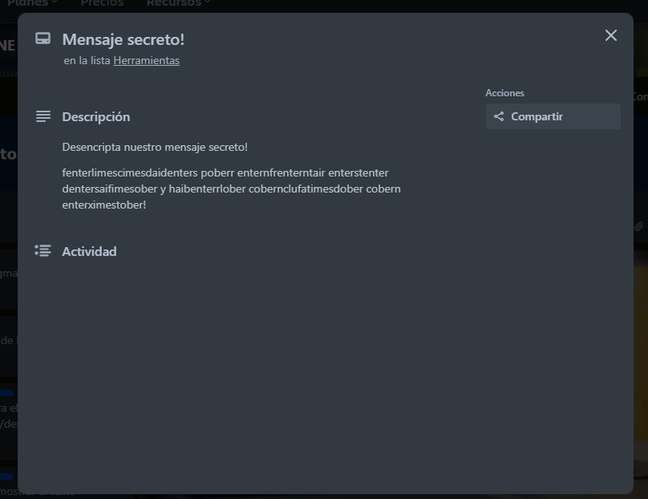

# [Alura ONE Challenge: Encriptador de texto.](https://cesarcarmona30.github.io/EncriptadorONE/)

Este proyecto es parte del programa Oracle Next Education (ONE) en colaboración con Alura. Consiste en una aplicación web que permite encriptar y desencriptar mensajes de texto utilizando un conjunto de reglas de sustitución específicas. El objetivo del proyecto es practicar y mejorar habilidades en HTML, CSS y JavaScript, aprendidas durante los cursos de formación en la plataforma de Alura, permitiendo así, el desarrollo de una interfaz de usuario intuitiva y funcionalidades interactivas.

> [Ver Página Web](https://cesarcarmona30.github.io/EncriptadorONE/)

### Funcionalidades

- Encriptado de Texto: Convierte un mensaje de texto en un formato encriptado utilizando un conjunto de sustituciones.
- Desencriptado de Texto: Permite revertir el mensaje encriptado a su formato original.
- Copiar al Portapapeles: Opción para copiar el mensaje encriptado o desencriptado al portapapeles con un solo clic.

### Tecnologías Utilizadas

- HTML: Para la estructura del contenido.
- CSS: Para el diseño y la estilización de la interfaz.
- JavaScript: Para la lógica de encriptado, desencriptado y manejo de eventos.

### Cómo Usar

1. Ingresa el texto que deseas encriptar o desencriptar en el área de texto.
2. Selecciona la opción de "Encriptar" o "Desencriptar".
3. Usa el botón "Copiar" para copiar el resultado al portapapeles.

### Mensaje secreto

|  |  |
| :----------------------------------------: | :----------------------------------------------: |

### Licencia

Este proyecto es parte del curso de formación de [Oracle Next Education](https://www.oracle.com/mx/education/oracle-next-education/), y está licenciado bajo la [Licencia MIT](https://opensource.org/licenses/MIT).
